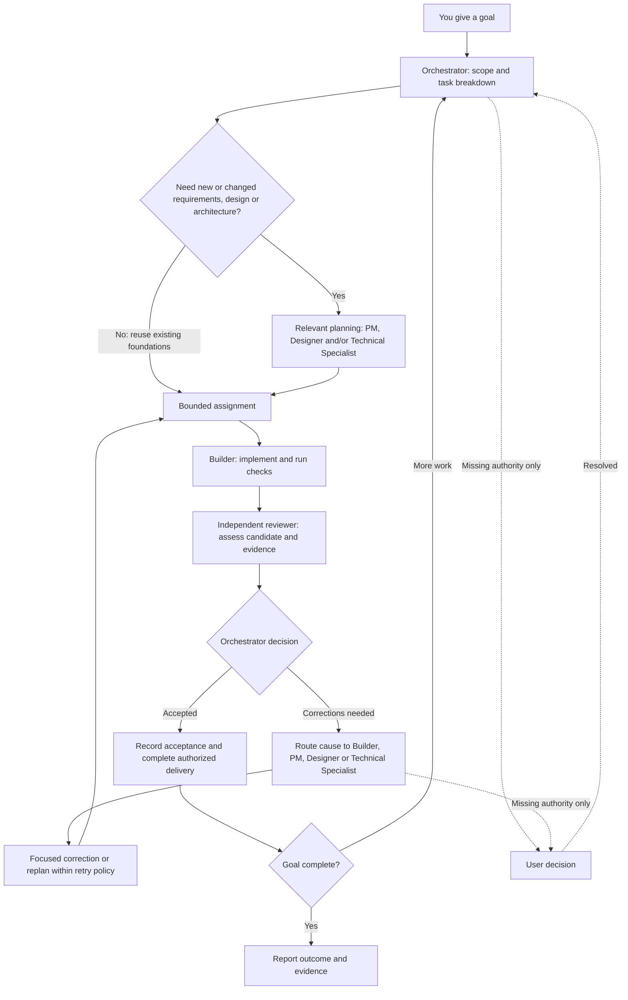

# Product-Studio-v2

A local operating system for an agent-led product studio. The user owns product
direction; the orchestrator owns delivery; builders implement; focused independent
reviews support the orchestrator's final decision.

This is a separate successor to Product-Studio. It does not change the existing
OpenClaw setup. No background automation, paid service, remote repository or
production deployment is enabled by creating this folder.

## How the studio works

The usual path is a bounded assignment, implementation, one relevant independent
review, and orchestrator acceptance. Planning roles join only when needed; agents
retain freedom over implementation choices within the agreed boundaries.



The planning box selects the roles needed for the uncertainty; it does not require
all three. For a new product, establish enough shared design and architecture to
support the first feature, then evolve them. Record consequential decisions where
they arise; routine coding choices do not need extra documents. Failed checks can
return directly to correction before formal review.

The orchestrator resolves failures at their source, with bounded retries and no
elapsed-time approval gates. Push, merge and deployment happen only within existing
authority and are reported separately from acceptance. This diagram describes the
agent workflow; the CLI does not dispatch agents automatically.

| Source of truth | Contents |
| --- | --- |
| This studio, under `products/<project>/` | PRDs, design/technical specifications, decisions and acceptance records |
| Separate application repository | Code, tests, dependencies and deployment configuration |

Reviews reference both the code candidate and the relevant specification revisions.
See the [delivery workflow](operating-system/WORKFLOW.md) for the short operating rules.

## Start here

1. Read [AGENTS.md](AGENTS.md) and [standing orders](operating-system/STANDING_ORDERS.md).
2. Copy `products/_template/` to `products/<project>/`. Replace `PROJECT` in
   metadata and document IDs. Fill the project contract and authority before work.
   Drafts become approved only when backed by an actual user decision.
3. Keep that project's PRDs, design records, decisions and evidence in its folder.
   The application may live in its own repository; identify it in the contract.
4. Select only useful records from the [document template catalog](operating-system/templates/README.md),
   then give the builder a compact [assignment](operating-system/templates/assignment.md).
   Preserve relevant decisions and select only necessary reviews.
5. Verify the candidate, obtain the selected review, and record acceptance and
   the next action. Push/merge/deploy are separate delivery states.

## Local commands

Requires Node.js 24 or newer. No package installation or API key is required.

```sh
npm test
npm run check
npm run index
npm run retrieve -- --project my-project --query "onboarding"
```

Create `my-project` from the template first. Retrieval requires an explicit project;
it combines that project's context with shared studio rules. It excludes other
projects and template material. Read an exact source directly when already known.

## Layout

| Folder | Purpose |
| --- | --- |
| `operating-system/` | Studio authority, delegation, workflow, roles and templates |
| `products/<project>/` | Project-owned contract, PRDs, design, decisions and evidence |
| `harness/` | Local validation, state, retrieval and metrics tools |
| `graph/` | Metadata/relationship conventions; graph is generated from documents |
| `docs/` | Migration notes and setup verification |
| `.runtime/` | Ignored, rebuildable local search index |

## What changed

- No elapsed-time approval gates; time remains diagnostic.
- Explicit delegation and operational authority, with one relevant review by default.
- PM available for product ambiguity and documentation, without becoming a gate.
- Optional [Technical Specialist](operating-system/roles/TECHNICAL_SPECIALIST.md) owns
  architecture/API/data/security planning, technical documents and difficult debugging.
  Builder implements the agreed design and owns implementation notes and tests.
- Approved project decisions travel with assignments.
- Project-scoped, incremental section retrieval and source-derived graph links.
- No imported product history or project-specific validation in the studio check.

See [the harness guide](harness/README.md), [migration notes](docs/MIGRATION.md)
and [verification record](docs/VERIFICATION.md) for implementation limits.
The CLI records and validates work; the host agent runtime dispatches agents.

Shared templates are optional and excluded from project retrieval. Completed records
belong under `products/<project>/`; the PM chooses the smallest useful set and the
relevant specialist owns its accuracy. A project's `ROADMAP.md` is its single source for
milestone status, exit criteria and evidence.

## Repository handoff

The authorized repository is https://github.com/JKay93/Product-Studio-v2.git.
Do not connect or push this work to the original Product-Studio repository.


For a parent workspace such as Codex-Work, copy [the workspace entry point](docs/WORKSPACE_AGENTS.md) to that parent folder as AGENTS.md. It directs new tasks to this studio. The active parent copy lives outside this Git repository.
