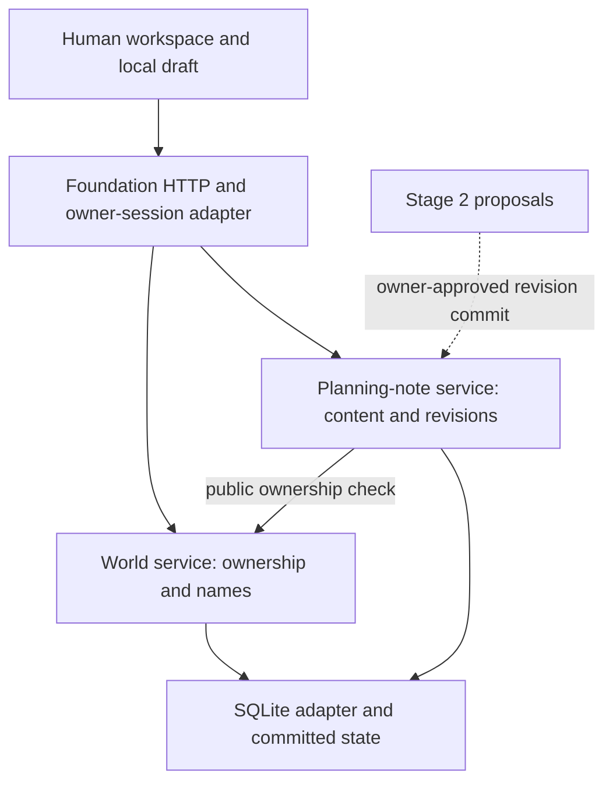

<!-- studio {"id":"byoa-world:technical-context:foundation-plan","scope":"byoa-world","type":"technical-context","status":"approved","links":[{"relation":"requires","target":"byoa-world:roadmap:main"},{"relation":"requires","target":"byoa-world:contract:main"}]} -->
# Stage 1 foundation proposal

Owner: orchestrator, with PM, Technical Specialist and Designer input. Revision 2, updated: 2026-10-01.
Status: approved by the user on 2026-10-01; Stage 1.1 authorized under [Decision 002](../decisions/002-world-foundation.md). Proposal wording below preserves the reviewed package; selected recommendations are approved as recorded in that decision.
Scope: BYOA-FND-01–12 in [ROADMAP.md](../ROADMAP.md). Authority: [handoff](../handoffs/STAGE-1-FOUNDATION-HANDOFF.md), latest [contract](../CONTRACT.md), [organization](../decisions/001-project-organization.md), [modularity](MODULARITY.md).

Reassessed by explicitly routed GPT-6.1 Sol Medium specialists; [assignments and evidence](../runs/stage1-61-reassessment.md). Model configuration approval is separate from foundation approval. Main changes from revision 1: one planning note per World; SQLite replaces JSON as the recommended store; React/TypeScript/Vite replaces vanilla JavaScript as the recommended new UI; response ambiguity and retained legacy access are explicit. The earlier options remain alternatives, not rejected approved decisions.

## Problem, outcome and scope

The user selected **a project space with a planning note** as the first useful human task in this chat. Other choices below remain recommendations. The original PDF, read on 2026-09-30, supports persistent Worlds, human-only participation, native resources and authority outside models; it does not mandate this stack or note type.

A World is a persistent, named workspace owned by the local human. Initially it represents one project; do not add a second Project entity or imply that World and Project must always be equivalent. Creating it establishes an empty resource scope, not an agent run or Session.

| Priority | Proposed behavior |
| --- | --- |
| Must | List, create, open and rename Worlds; identify the local human owner |
| Must | Create, open, edit and explicitly save one plain-text planning note per World with title and body |
| Must | Retain saved content after navigation, page reload and server restart; two Worlds prove correct resource scoping |
| Must | Clear empty, loading, unsaved, saving, saved, failed and conflict states |
| Next stage | Two real agent participants, scoped Sessions and proposals, using approved Stage 2 design |
| Later | Multiple notes/resource browser, rich editing, attachments, search, connectors, teams, real account onboarding and cloud operation as separately selected |
| Excluded | Weekly pilot, provider runs, private inputs, scheduled work, spatial UI, marketplace and deployment |

One planning note per World is sufficient for the selected proving journey. Stable resource IDs permit later additions; no resource browser, tasks database, chat, folders or dashboard is required now. Inputs remain fictional or specifically curated public material. Proposed limits: World name 1–80 trimmed characters, note title 1–120, body up to 50,000 characters; empty body allowed and body whitespace preserved. Duplicate names allowed because stable IDs identify records. These numerical limits may be tuned within bounded-input/usability requirements. No delete action in this slice.

## Users and journeys

Entry → Worlds list → Create World (name) → empty workspace → New note → title/body → Save → leave and reopen → restart and reopen. A second World starts empty and never displays the first World's notes.

Navigation: app header contains Worlds and local-owner label. Inside a World, a compact sidebar links Planning note and World details (name/owner). Main area contains the empty/create-note state or editor; World details owns Rename. No unavailable Agents, Sessions or Settings tabs. Native note creation happens on the first successful save; a blank editor is a draft, not an already committed resource.

| State | User-visible behavior |
| --- | --- |
| No Worlds | “Create your first World” and one Create action |
| Create World | Validate name; retain it on failure; show Creating until acknowledgement; disable duplicate submission; on uncertain response reconcile using the creation command key before retrying |
| Rename World | Retain typed name on failure; show Saving name until acknowledgement; revision-check; on stale rename show current saved name alongside local name and require deliberate reload/retry; warn before discarding dirty name |
| Uncertain rename | Show confirmation unavailable; fetch saved World revision/name and reconcile; never announce saved from request dispatch alone or blindly overwrite a newer name |
| Empty World | Named World and owner remain visible; “No notes yet” and New note |
| Editing | Visible Unsaved status; explicit Save and keyboard save shortcut |
| Saving/saved | Saving only while request pending; Saved only after durable server acknowledgement |
| Navigation while dirty | Save and leave, discard and leave, or keep editing; browser-close warning where supported |
| Save failure | Keep draft in memory, explain failure, allow deliberate retry; never announce success |
| Stale revision | Keep local draft, explain newer saved version; offer view/reload only after explicit discard confirmation |
| Lost save response | Status says confirmation unavailable; fetch saved revision/content to reconcile before retrying; preserve draft and avoid duplicate creation |
| Server/storage unavailable | Distinguish load failure from empty World; retry does not create replacement data |
| Restart | Reopen saved note; unsaved crash recovery is not promised |

## Design system and appearance

Recommended direction: calm writing workspace. Neutral light/dark surfaces, restrained green emphasis, clear dividers, generous editor width and a compact navigation rail. Alternative: denser utility layout with tighter rows for users who prefer scanning many items. No agent avatars or activity counters until those capabilities exist.

Proposed tokens: system sans-serif; 16px editor text, 14px controls, 12px secondary metadata; 4/8/12/16/24/32px spacing; 6–8px control radii; approximately 220px desktop navigation and 720px reading width. Semantic colors: canvas, surface, text, muted text, border, accent, focus, danger and success. Final values must meet contrast checks; color alone never conveys save state.

Components: app shell, World list row, labelled field, textarea, primary/secondary button, inline error, save-status text, empty state, unsaved-change dialog and conflict comparison. Use native semantic controls first. Shared components contain presentation behavior only; features own validation and save rules. React components implement these conventions; no third-party component library or rich editor is required.

Desktop shows sidebar and editor; below about 720px use a single column and a labelled navigation disclosure. Verify 360px and 1280px plus 200% zoom. Touch targets approximately 44px; visible focus, logical keyboard order, associated labels/errors, status announcements, restored focus after dialogs and reduced-motion support. No hover-only actions. English-only copy initially, without layout assumptions that require short titles.

Conceptual mockups are shown in the discussion, not implementation evidence. The user preferred the Calm workspace variant; review its remaining states with the rest of this package. The updated concept uses one note per World and illustrates load/save/conflict/empty/narrow states; fictional in-memory actions reset on reload. Source preview: `C:/Users/jingk/.codex/visualizations/2026/09/29/01a0eeca-f817-73b1-97c2-8fc4574329e8/byoa-foundation-61.html`. Syntax/state checks are separate from browser layout/contrast evidence, which remains unverified.

## Current state — observed

Application: sibling `BYOA-World/`, published baseline `0312413`; local Phase 1 changes are uncommitted and must be preserved. Inspection is read-only; existing test results are historical, not rerun evidence.

| Existing area | Reuse disposition |
| --- | --- |
| `package.json` | Node >=24, ES modules, built-in test runner, no declared third-party dependencies; retain by default |
| `src/app/repository.js` | Reuse transaction/rollback failure expectations, not Session-owned singleton schema or JSON implementation; temporary replacement is not proof of power-loss durability |
| `src/app/server.js` | Reuse owner-cookie/CSRF and error-handling concepts after checks; do not reuse pilot routes as foundation behavior |
| `src/shared/dom.js`, `errors.js` | Reuse safe text/error conventions; React owns new rendering; avoid trimming note bodies through generic text-input helpers |
| `src/app/ui.js`, `style.css`, `shell.html` | Existing UI is fixture-oriented; compose a new foundation surface rather than incrementally hiding pilot controls |
| `features/collaboration/document-review/` | Preserve saved-proposal/history behavior for Stage 2; do not force a human note through two-contributor review |
| `features/work/session/`, `features/agents/connection/` | Preserve separately; no live adapters or weekly-fixture imports in foundation startup |
| `src/app/boundaries.test.js` | Existing dependency checks are useful input; extend for approved foundation boundaries and inspect current exceptions |

Static inspection also found a 40,000-byte HTTP body limit and per-chunk UTF-8 decoding in the owner route. Foundation parsing must use bounded Buffer accumulation and one decode; legal multibyte input must survive split chunks. This is an inspection finding, not a newly demonstrated runtime failure. Existing import checks cover only some JavaScript import forms, while the server directly imports a Session internal pilot helper. New foundation enforcement covers TS/TSX, aliases, re-exports and dynamic imports without silently claiming the old tree is compliant.

## Planned state — not yet implemented

Recommended stack: **React + TypeScript + Vite for the new workspace; Node with TypeScript feature services; plain CSS tokens; SQLite behind feature-owned repository ports**. Existing legacy JavaScript remains retained. This supports explicit editor/dialog state and later participant/review UI without a broad framework or hosting migration. TypeScript checks internal contracts; runtime HTTP validation is still required. React and Vite require project-local dependency installation and a build pipeline during approved Stage 1.1, not during design. Pin compatible versions/lockfile then; do not upgrade global tools or silently change the selected runtime.

Bundled Node was read-only verified as **v24.19.0** on 2026-10-01. Its built-in SQLite API is still a release candidate, with synchronous calls. Proposed acceptance includes this known maturity limit, adapter isolation and short bounded transactions. Record/pin the actual application launch runtime and test its API during implementation; bundled version availability does not prove every existing launcher uses it. If unavailable or incompatible, return the specific blocker rather than silently choosing a driver. [Node 24.19 SQLite documentation](https://nodejs.org/download/release/v24.19.0/docs/api/sqlite.html).

SQLite is recommended because ownership, canonical revisions and competing saves need transactional constraints. Use a new ignored `.foundation/worlds.sqlite` on local disk, foreign keys, prepared statements, versioned migrations, durable synchronous settings and bounded contention handling. Keep committed note revisions internally; a history browser is deferred. Start with rollback journaling; do not introduce WAL or external database operations without a demonstrated need. Save acknowledgement follows commit, and failures roll back both canonical content and revision metadata. [SQLite transactions](https://www.sqlite.org/lang_transaction.html).

| Alternative | Consequence |
| --- | --- |
| Modular native JavaScript + Node + SQLite | Valid smaller-investment choice; fewer dependencies, but custom UI state/dialog management as the product grows |
| Existing stack + separate JSON store | Can support durable bounded single-process work, but requires application-owned locking, constraints, recovery and later migration; earlier recommendation retained as an option |
| PostgreSQL/cloud stack | Defer until remote multi-user operation is selected; adds infrastructure and identity work outside this journey |

Ownership flow: browser → foundation HTTP adapter → World/note services → repository ports → SQLite adapter. Server validates owner, World/resource association and input; browser never chooses trusted ownership. Database commits own canonical work; browser owns only unsaved drafts.



Official framework references: [React component/state guidance](https://react.dev/learn/thinking-in-react), [TypeScript handbook](https://www.typescriptlang.org/docs/handbook/intro.html), [Vite guide](https://vite.dev/guide/). Preview uses one reviewed application origin. Any temporary Vite development server is loopback-only with exact-origin configuration; do not weaken existing owner-origin controls to make a proxy work.

| Entity / boundary | Proposed rule |
| --- | --- |
| Local owner | Stable server-side ID; UI says Local owner; no verified account or multi-user claim |
| World | ID, owner ID, name, timestamps and revision; server derives ownership |
| Note | Stable ID, World ID and current revision; one planning note per World in this slice |
| Note revision | Exact title/body, revision number, human author ID and committed timestamp; retained internally |
| Owner session | Reuse/check local session and CSRF pattern; bind loopback; reject invalid session/origin/token |
| Cross-World request | Require note belongs to requested World even if same owner owns both |
| Save | Expected revision required; conditional transactional update; conflict never silently overwrites |
| Startup corruption | Show recoverable failure; never silently seed over damaged data |

SQLite admits one writer at a time. Keep lock waits bounded, expose contention as a recoverable error and avoid blanket automatic retries. A local database does not establish distributed/cloud readiness. Size HTTP limits for UTF-8 and JSON escaping, not character count alone. Use owner-scoped persisted creation command keys so an uncertain World/note creation response cannot create duplicates. On lost save acknowledgement, reconcile content/revision before another update; never silently overwrite or discard the browser draft.

Stage 2 seam: stable World/resource IDs, attributable revisions and owner-authorized mutations. Agent proposals will later enter through an explicit reviewed interface; they never acquire the human save endpoint by supplying an owner ID. Do not build protocols, queues, grants, Passport, provider abstractions or Session infrastructure now.

### Proposed file organization and public interfaces

Paths below are relative to the application repository and are proposals, not newly created folders.

```text
src/
  app/foundation/                   # server.ts, start.ts, browser.tsx, shell, integration tests
  features/worlds/workspace/        # index.ts, model/service, repository-port, UI public entry, tests
  features/resources/planning-note/ # index.ts, model/service, repository-port, UI public entry, tests
  platform/local-owner/             # loopback session and CSRF authority adapter
  platform/sqlite/                  # implements feature ports; migrations and adapter tests
  shared/ui/                       # only demonstrated shared controls and CSS tokens
  shared/contracts/                # named transport/error contracts; no catch-all service
  shared/                          # retained legacy helpers
  features/work/session/      # retained historical implementation
  features/agents/connection/ # retained; not loaded by foundation startup
  features/collaboration/document-review/ # retained for Stage 2 assessment
```

World public interface: list/create/get/rename and ownership assertion; rename uses expected World revision. Note public interface: get/create/save with World ID, stable resource ID and expected revision; first create uses a creation command key. Repository ports are owned by features; SQLite implements them without exposing raw SQL/database objects. Domain exports and browser exports use separate public entries. App composes dependencies; notes call World's public authorization interface, not internals. Domain code does not import browser UI or runtime/provider adapters. Transport errors distinguish validation, denial/not-found, conflict, oversized input and unavailable storage. Add boundary checks covering TS/TSX and build aliases. No generic plugin system.

### Preservation, compatibility and rollback

Before implementation, inventory tracked/untracked files and capture a recoverable candidate without overwriting user work. Preserve ignored data/evidence separately; a Git snapshot alone cannot retain `.data/` and `.phase1/`. Create a distinct foundation startup and new database. Initialize only a missing database; reopen compatible existing state normally, migrate only approved known schemas with a backup, and refuse unknown/corrupt data. Foundation startup must not initialize or import pilot execution.

Preserve accepted book-swap, proposals/history, cycle identities and reservations. No automatic legacy import or state rewrite. Stage 1.1 delivery documents the exact retained legacy entry point and storage locations and verifies owner access to saved work without launching a bridge/provider/pilot cycle. Legacy constructors can alter Session lifecycle on startup, so access verification uses isolated copies and an inert/read-only retained-work view if needed; it must not reopen grants or rewrite original evidence. A visible import requires a separate mapping/decision. Rollback returns to retained startup without deleting new foundation work or resetting old budgets. Database migration rollback restores its pre-migration backup and retains the failed candidate for recovery.

## Skills, tools and readiness

Selected now: PDF skill for source reading; visualize skill for conceptual screen/state review. Conditional for implementation: computer-use skill and available browser tooling for actual keyboard/responsive/save verification; read instructions at use. Existing Node runner remains for domain/persistence/HTTP checks; TypeScript/build checks add static contract verification. A browser runner may be used if already available; do not invent an installed UI skill or browser-testing dependency. No imagegen, Sites migration/hosting or new plugin is required. Project-local React/TypeScript/Vite setup is part of the proposed stack to approve, with zero new external spending.

## Bounded delivery and acceptance

After approval, record choices once, then delegate substantive implementation to a builder. One independent reviewer checks the actual integrated candidate. Use separate UI/domain builders only if interfaces and nonoverlapping write scopes are settled; sequential delivery is sufficient here.

| Assignment / IDs | Write scope and deliverable | Dependency / checks |
| --- | --- | --- |
| A: WLD-01/03 | Project-local build setup, foundation startup, SQLite/owner adapters, World feature/tests; preservation inventory | Approved package; pin runtime/dependencies, ownership, transactions, create two Worlds and restart |
| B: WLD-02/04 | Foundation shell, shared UI, notes module and affected routes/tests | A's public interfaces; create/edit/save/reopen, dirty navigation, conflict/failure and narrow layout |
| C: WLD-05 | Integration fixes and evidence for actual candidate; reviewer read-only findings | A/B; scope denial, storage/corruption/unknown-schema failure, competing saves, lost responses, UTF-8/body limits, CSRF, browser journey, affected legacy checks and preservation manifests |
| D: WLD-06 | Walkthrough and records only | Reviewed candidate; user sees create → write → save → reopen → restart plus second World |

Each dispatch names source revision, exact paths, preserved decisions, checks and recipient. Default correction bounds remain two implementation corrections and one review correction before replanning. All test data must be isolated. No provider regression runs. Milestone status remains in ROADMAP.md.

## Decisions and risks

Approve or amend: one planning note per World; calm visual direction and complete screen/state design; explicit Save/recovery contract; React/TypeScript/Vite + Node + separate SQLite database (including built-in adapter RC limitation); local-owner identity; preserved legacy access without automatic import; bounded Stage 1.1 setup/build/review assignments. Routine naming, token tuning and compatible project-local dependency version pinning may be delegated within those choices. Material stack/driver/identity changes or effort escalation require an explicit decision.

Limits to carry forward: local demo identity is not organizational authentication; saved notes do not prove private-data readiness; synchronous SQLite transactions must remain short and adapter maturity remains a known risk; crash can lose unsaved browser text; legacy work is preserved separately rather than presented as migrated. Material changes to scope, appearance, stack or identity return for decision. Design review is not implementation acceptance or a measured model-performance/cost comparison.

Template mapping: this compact package combines PRD (problem/scope, behavior/state tables, acceptance), design (users/journeys, design system, adaptation/access), and technical-context (observed/planned state, decisions/risks) to avoid premature feature-record duplication. Detailed source/requirement IDs and approved feature records follow the decision; this draft's stable document ID identifies the review package.
