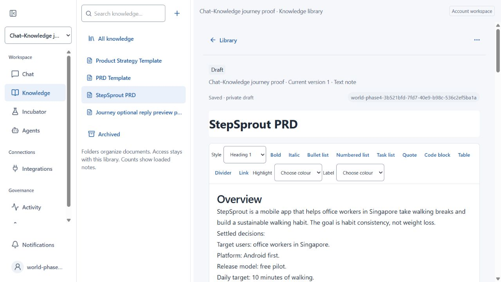

<!-- studio {"id":"world:run:2026-10-10-chat-knowledge-journey","scope":"world","type":"run","status":"partial"} -->
# Complete Chat → Knowledge journey

## Result and live test report

**Scoped implementation delivered; full Agent journey PARTIAL.** Reply saving uses
an embedded editable preview with explicit Save/Cancel. Saved cards open the current
Knowledge item. Existing composer/question styling is cohesive. Additive060 replaces
the fragile model-search requirement with a protected server creation preflight.
Continuation errors now preserve their original failure stage/closed diagnostics
instead of appearing as completed work. No provider, call or financial limit changed.

Browser PASS: desktop/390px Cancel, focus recovery, Shift+Enter newline, editable
title, explicit private Save, correct saved-item opening, Agent-created PRD opening,
manual rich-edit autosave and PRD reopening after page reload. The manual sentence
“Activity summaries are retained for exactly 14 days.” persisted in the live rich
draft, independently verified through authenticated collaboration open. The original
immutable version remains separate. Reload initially restored the account's earlier
workspace selection; reopening the test World/Knowledge proved data persistence,
not automatic view-selection restoration. No material question cards were generated,
so this run has no live ambiguity/resume proof beyond the prior offline checks.

Six frozen scenarios/eight human turns (two Strategy retries)/eleven model calls.
Idea/facts/PRD PASS; Strategy/revision/reopen FAIL. Small functional sample only;
no general accuracy percentage or verified Codex parity claim.

| Scenario / attempt | Semantic result | Observed latency | Input tokens | Output tokens | Estimated cost |
| --- | --- | ---: | ---: | ---: | ---: |
| Idea exploration | PASS; natural assessment, no intake/document | 12.797 s | 8,196 | 528 | US$0.021672 |
| Settled product facts | PASS; no repeated requirements | 16.612 s | 9,101 | 1,033 | US$0.028532 |
| Strategy, first | FAIL; save rejected42501 | 20.810 s | 23,913 | 1,390 | US$0.061726 |
| Strategy, after060 | FAIL; bounded stop, no document despite complete status | 14.635 s | 21,604 | 370 | US$0.046908 |
| Strategy, diagnostic retry | FAIL; no fresh template read, save rejected42501 | 18.922 s | 14,407 | 1,649 | US$0.045304 |
| PRD | PASS; proper template, one private draft, facts/TBDs retained | 31.055 s | 33,643 | 2,473 | US$0.092016 |
| Revise target, preserve manual edit | FAIL; read rejected22023 | 17.518 s | 22,322 | 221 | US$0.046854 |
| Answer after reopening | FAIL; read rejected22023, no fabricated answer | 13.215 s | 22,907 | 363 | US$0.049444 |

Totals: **156,093 input/8,027 output tokens; US$0.392456**. Mean observed latency
18.196s; range12.797–31.055s. Tokens aggregate multiple calls;32k remains per call.
Cost uses existing application2/10microUSD input/output estimate, not provider invoice.
Latency is enqueue HTTP start→terminal polling, including up to1.5s poll overhead.
All original failures/costs remain counted. Manual saves and zero-spend diagnostics
are excluded. No paid test after eight-turn bound; US$0.75/cumulative caps preserved.

### Remaining runtime blockers / next action

1. Template readiness still depends on model behavior. It can request save before a
   fresh current-attempt read; the server correctly rejects it but work fails. Review
   permission versus source-bound document readiness and a bounded preparation contract
   for existing target/template discovery and reading, rather than more prompt patches.
2. Combined source accounting blocks normal rich-document continuation. The current
   PRD snapshot has63passages/5,725characters, within64/12k full-read bounds. An exact
   restricted-worker rollback replay of the failed revision read gives`22023 / Source
   limit` when combined with earlier references. Review allocation/retention while
   preserving provenance, privacy, citation integrity and source fences. Reopen has
   the same error code but no independent exact replay. Do not simply lift spending
   caps or remove permission checks.
3. Earlier third-call`next_call_unavailable` cause remains unknown. Worst-case scoped
   reservation probe PASS; minimal free count probes accepted both tool catalogs.
   Original opaque native request was not retained. Diagnostics are now corrected;
   do not retroactively label the old failure a provider issue.

No Strategy saved; PRD truthfully documents that absence. Failed revision changed no
document: target remains10minutes, not15; manual14-day correction remains. Optional
manual save created one separately named private proof item. No publication/human edit.
Bounded correction/retry allowance consumed; whole workflow acceptance stays open.

### Verification and environment

Independent QA PASS for scoped UI,060, proof fixtures/helper and final diagnostics;
whole journey PARTIAL. Root527tests/81files, type/lint/isolatedbuild PASS before final
diagnostic repair; final53affectedtests/4files and root17runtime tests PASS after it.
All60 migration reconstruction/candidate+installed document rollback proofs and final
installed digests PASS;001–059 unchanged. Acceptance applies to scoped changes only.

Human login`mehvinci`, Personal space/My Agent6 restored; viewport override removed.
Localhost/reviewed restricted provider worker running. Final0activejobs;892ledgerrows,
8,775,504microUSD used/held/9,505,910cap. No production release or Phase9. Repository
delivery receipts follow below. Original test setup defects/failures remain below.

## Scope and execution record

User approves the combined proposal and explicitly requests tests after implementation.
Goal: natural exploratory conversation; template-aware strategy/PRD creation and
same-document revisions; readable preview, clear saved-document access, editing/save
without the awkward reply modal; cohesive Chat/composer/cards/work/Knowledge styling.
Keep Calm Fluent direction and existing Tiptap/Yjs/Markdown/shell primitives. No new
provider/service, publication, production, human-data edits or budget enlargement.

Tasks: J1 Builder audit/implement cohesive UI and connected document interactions;
J2 Builder repair demonstrated runtime/document continuation gaps; J3 independent
QA actual candidate/evidence; J4 root controlled real-Agent journey/browser/metrics,
final acceptance and verified delivery. J2 follows real findings, not speculative
additional harness restrictions. Root owns records/live tests; workers offline.

Acceptance: idea exploration doesn't turn into generic intake; known facts/answers
stay settled; material ambiguity gets one question surface and coherent resume;
known permitted template structure informs strategy/PRD. Explicit creation saves
one owner-private draft, revisions update the same item without accidental duplicate
or publishing; editing/reopen/chat continuation preserves human corrections. Manual
reply save remains optional and editable with current permissions and correct scope.
Readable chat and compact request/work/preview surfaces work at wide/narrow widths,
keyboard/Enter/Shift+Enter/mention/draft preservation remain. Real synthetic journey
must run after final source installation; report per-step result, input/output tokens,
cost and enqueue-to-durable-result latency, with rubric limitations and failures.
Affected/offline regression/type/lint/build, proportional protected SQL/API checks
and independent review required. Do not equate unit-test totals with live acceptance.

Authority: latest user permits bounded live Agent testing including internal runtime
prompt/tool payloads required by that journey, using synthetic fixtures only and the
existing approved development provider/cumulative ledger. No new credentials or
human prompt export. Internal stop budget US$0.75 and at most8paid human turns;
existing per-job/call/retrieval/time/financial bounds still apply. If remaining cap
blocks required live evidence, complete unaffected work and report exact blocker.

Baseline World maina71997596615b0fd334b4a56f7031b4d8de7dee1; Studio main27261241d6e68aa2cdc183f8fd8c970f7c687e71.
Installed59; last recorded884ledgerrows8383048microUSD/cap9505910. Fresh state required
before live ops. Preserve unrelated next-env.d.ts/tsconfig.json/temp directories.
Routing SHA1C46027A5AABE051940D9F912FC39A77D1068F68E6B04FE4BC3DCDF7DA997E3F;
Builder gpt-6.1-sol/low/none, QA gpt-6.1-sol/medium/none; activation unknown.
Questions none. Status: implementation and live verification; no final acceptance yet.

J1 initial candidate: eight UI/test files independently audited by QA ceiling_review
(requested gpt-6.1-sol/medium/none, activation unknown). Embedded optional editable
reply preview with explicit save/cancel/current-item reopening, native titled save
cards and cohesive composer/request styles. Builder affected44tests/type/lint PASS;
root full526tests/80files, typecheck and isolated production build PASS.

Live fixture bb7f8e3c-2f24-4402-acea-3aad57881ced contains only synthetic StepSprout
context and two owner-private declared templates. Frozen rubric SHAa10bac0a66ceac0a4783931bfdaded5b20ed289d64dba1bf34f6e1c652a5dcbe.
Root setup mistakes retained: omitted separate direct enqueue (zero calls), then
inventory limit100 rejected (completed output/usage retained; corrected to50).
Corrected helper independently reviewed before paid use. Idea/facts complete with
no question cards or documents. Strategy first attempt failed finish42501 after
read-template→save, missing mandatory model-search receipt. First failure retained;
4calls estimatedUS$0.111930 so far. Builder J2 implementing deterministic exact-title/
folder/World/owner preflight in additive060, preserving all other effect safeguards.
One explicit frozen-prompt retry maximum; original evidence cannot be overwritten.

Browser currently temporarily uses approved fixture1 account after verifying stored
fixture3 restores the human login; original human selection unchanged. Inline preview
opens with rich content; keyboard Cancel closes, creates no item and restores trigger
focus. Pointer Cancel initially intercepted by composer because70vh preview exceeds
visible conversation height: Builder correction required. Duplicate raw/virtual user
inputs also observed: direct enqueue adapter omits sourceMessageId; investigation
required. Builder traced duplicates to root test helper: actual UI passes message.id
as enqueue's third argument (jobid), notsourceMessageId; authoritative jobid/messageid
match already prevents duplicates. Helper corrected accordingly; original3cases
retain setup defect, no speculative product pairing change. Root will restore human
login before delivery; unused temporary3001preview stopped and its tab closed.
An isolated127.0.0.1 preview was unusable because request-origin checks compare against
localhost; no security relaxation made. Production custom-origin verification deferred.

Final J2 source independently QA PASS:060SHA7CA6E2AE59120BD7DC9B99810B8DA8106602B30C45FC22A27D5418C3E839B8A8.
Creates internal inaccessible RLS preflight evidence; current item and current rich
draft normalized exacttitle/folder/actor/World collisions reject without overwrite.
No fabricated search call, new exposed RPC/grant, worker/model/budget expansion or
change to001–059. Protected proof initial fixture failed Ownerimmutable guard and
rolled back; corrected public invited/participating/explicitly granted borrowed-Agent
fixture proof SHA48CD68D75AD55ADBEF9C7ECB371A0B1AE2B99D7B1ED94EDB2665AA33DC6D6812
PASS18reportedgroups plus new scoped preflight assertions. All60 rebuild fromempty
rollback schema PASS. Idle0eligible,887rows8494978microUSD/cap9505910 confirmed before
060 installed; installed rerun pending. Footer correction40dvh scrolling fields with
actions outside scrolling, explicit non-submit buttons reviewed; desktop/narrow390px
pointer+keyboardCancel and focus recoveryPASS, no saveditem; ShiftEnter preservesnewline.
Final527tests/81files, scopedlint, typecheck and isolatedproductionbuildPASS. No second
root fullsuite needed after test-only borrowedfixture correction; affectedsyntax/lintPASS.

Installed060 autonomous-document proof PASS. Strategy retry e1b4544f-0fac-4679-a1b8-6a0080cfdb6a returned complete but no document after search/read and next_call_unavailable; semanticFAIL, not accepted. Six calls nowUS$0.158838. Root scoped rollback third-call admission131200 PASS, terminaltools unchanged; reconstructed-context diagnosticPT409 rejected before provider (rollback retained binding). Free minimal synthetic history-schema count probes bothHTTP200, so no speculative providercatalog change. Proven execution diagnostic defect: continuation count/admission failures currently masquerade as completion. Builder receives second bounded runtime correction, preserve stage/closederror and spend/calls/security. One further frozen Strategy probe allowed after review as second total debug retry (two original failures retained), max8human turns/US$0.75 unchanged; this is not an automatic retry or reset.

Delivery: scoped World commit821e68f0b621565e0d185bef71eef978a6a54d1e pushed to
JKay93/MyWorld main; remote HEAD independently matches. Fourteen scoped files only;
next-env.d.ts/tsconfig.json/test-temp directories excluded. Independent final QA
confirms whole journey PARTIAL and measured totals, with scoped implementation PASS.
Studio report/continuity/design/browser evidence delivered separately to its verified
repository; its enclosing commit receipt is available in Git history and host output.
